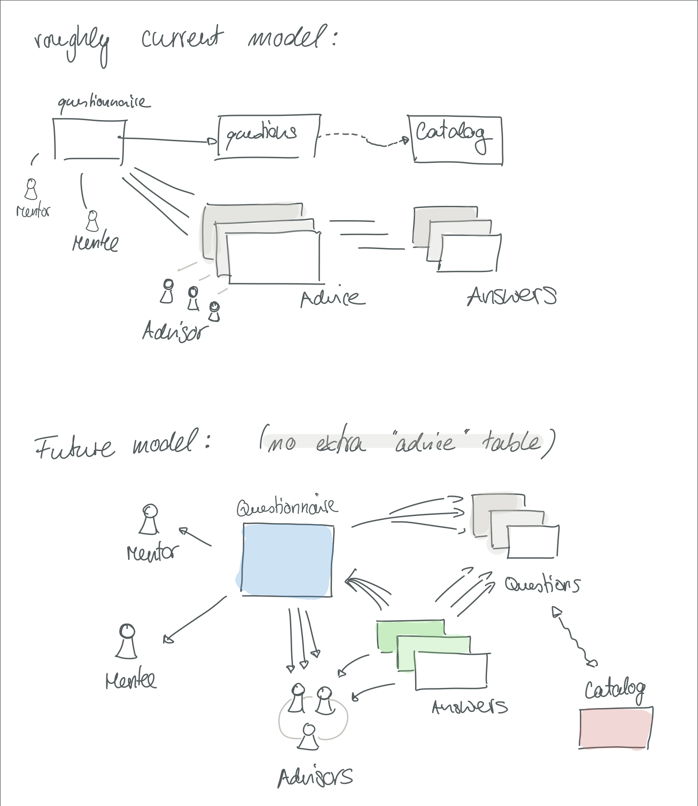

# Advisor

This little app sprung to life as an attempt to improve upon the current peer-feedback process.
The main point is to provide valuable insight by _giving advice_ and avoiding _generic feedback_.

Advisor allows you to create a form from a catalogue of questions and lets you direct that form to specific people.
This makes the insights more targeted to your current situation.

It also pushes the responsibility to collect and track the results away from a central authority and out the mentor/mentee pair.

Hopefully, this app will delight you by guiding you through a swift creation process.

# Domain Model

The picture below tries to sketch out the domain objects and their relationships.
The picture is meant to give a rough idea of what
_things_ are relevant in Advisorex.
Its neither complete nor detailed.
You can find more [here](lib/advisor/core/README.md)

# From your local machine

To start your Phoenix server:

  * Install dependencies with `mix deps.get`
  * Create and migrate your database with `mix ecto.create && mix ecto.migrate` 
    *  make sure to have a user `postgres` without password and superuser role
  * Install Node.js dependencies with `cd assets && npm install`
  * Seed the database with `mix seed`
  * Start Phoenix endpoint with `mix phx.server`

Now you can visit [`localhost:4000`](http://localhost:4000) from your browser.
